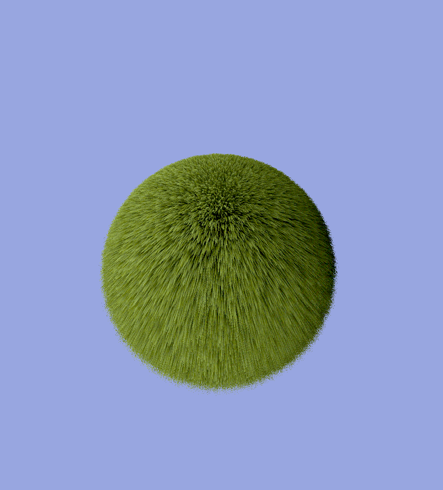

# Shell Texturing

This project is a small shell texturing demo utilizing my [pyrite](https://github.com/paratym/pyrite) rust game engine using Vulkan, works on Windows and Linux. 


<br/>

### Building
To build and run is very simple, just clone the repo and run it.
```
git clone https://github.com/pengiie/shell-texturing.git
cd shell-texturing
cargo build && cargo run
```

This small demo supports shader **hot reloading** on save, feel free to tweak constants or write additional shader code to make live edits. Any shader compilation errors will be reported to the console.

### Controls
WASD, Space, Shift - Movement keys. </br>
E - Toggles the mouse lock on the window. </br>
H, L - Decrease and increase grass resolution (number of planes). </br>
J, K - Decrease and increase grass height. </br>
